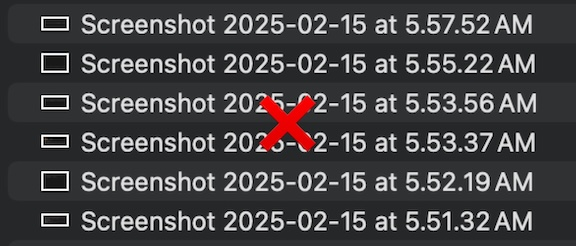
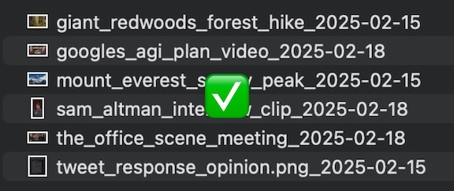

# Lily Screenshot Renamer

A simple utility tool that automatically renames your screenshots using AI to give them meaningful, descriptive names.

This is a "vibe coding" project. It is not perfect, but it works.

Uses 4o-mini for fast and cheap inference.

## Example

Before:

After:

## Installation

1. [Download the latest app](https://raw.githubusercontent.com/hoominchu/lily/main/lily-1.0.0-arm64.dmg)
2. Install and launch the app
3. Click the tray icon and select "Settings"
4. Enter your OpenAI API key
5. That's it! Enjoy a more organized desktop.

## Development

To run the app locally:

1. Clone the repository
2. Install dependencies with `npm install`
3. Run the app with `npm run dev`

